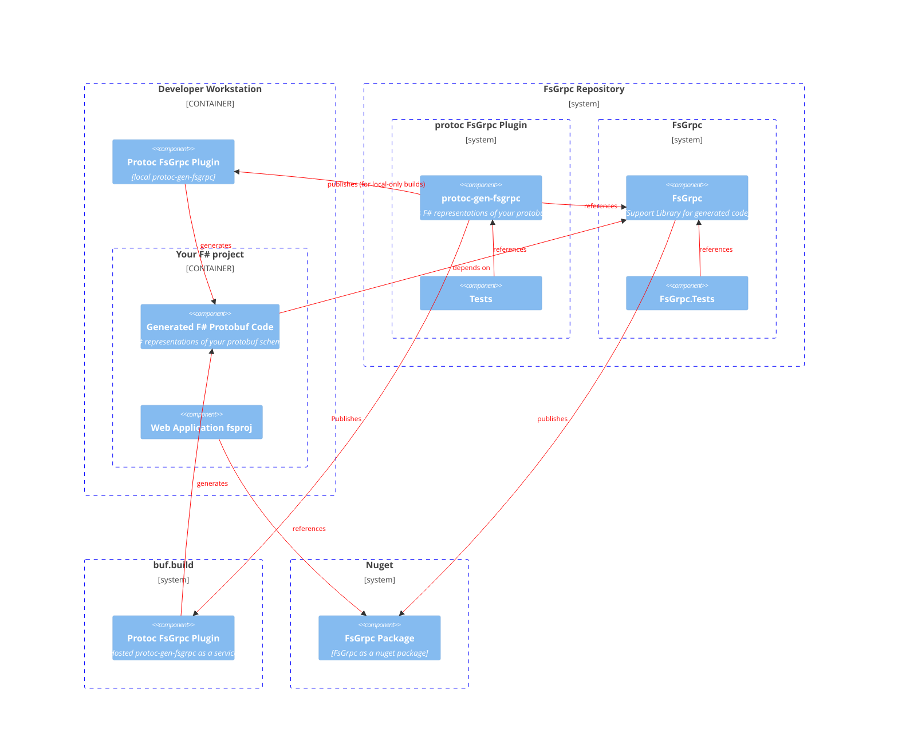

# FsGrpc
Idiomatic F# code generation for Protocol Buffers and gRPC

> *⚠️ this is currently a work in progress.  See the "Status" section
> for more info*

Generate idiomatic F# records from proto3 message definitions, complete with oneofs as discriminated unions, and serialize/deserialize to and from protocol buffer wire format.

# System Diagram



# Getting Started

There are a couple of approaches you can use to generate code from your protos.

## Option 1: Use the buf cli

1. If using buf (or if you just want to use the buf cli), start by installing the buf cli from https://docs.buf.build/installation.

2. Add the following "remote" section to your buf.gen.yaml (or create a new buf.gen.yaml if one doesn't already exist):
    A.
    ```yaml
    version: v1
    plugins:
    - remote: buf.build/divisions-maintenance-group/plugins/fsharp
        out: gen
        strategy: all
    ```
    B. If you need to run the plugin offline:
    1. Pull the fsgrpc repo locally
    2. Build the protoc-gen-fsgrpc project in that repo
    3. Change your buf.gen.yaml file to look like this:
        ```yaml
        version: v1
        plugins:
        - plugin: fsgrpc.exe 'fsgrpc for non-windows operating systems and fsgrpc.exe for windows
            out: gen
            path: <path to the fsgrpc repo>/fsgrpc/protoc-gen-fsgrpc/bin/Debug/net6.0/protoc-gen-fsgrpc
            strategy: all
        ```

3. Generate the code

	- Option 1:
		1. Place your protos in a folder named "protos" in the same folder as your buf.gen.yaml file.

		2. If your protos are in buf, you can export them into that folder by running:
	       `buf export buf.build/path/to/your/protos -o protos`

	       e.g. `buf export buf.build/googleapis/googleapis -o protos` will place the proto defintions for the google apis into the protos folder

		3. Run `buf generate protos --include-imports --include-wkt` in the folder where your buf.gen.yaml file is located.

	- Option 2:
		1. Run buf generate command directly referencing protos in buf
        `buf generate buf.build/googleapis/googleapis`

4. Add the generated code to your F# project
Using `buf generate` with the above example will generate .fs files in the "gen" directory, and also a Protobuf.targets file in that directory which includes those files in correct dependency order.

You then add the following line to your .fsproj inside the top-level "project" element:
```xml
<Import Project="gen/Protobuf.targets" />
```

And run

```bash
dotnet add package fsgrpc
```

or

```powershell
Install-Package FsGrpc
```

## Usage in F#

You can create a record by specifying all of the fields or using `with` syntax as follows:

```fsharp
let message =
	{ MyMessage.empty with
	    Name = "a name value"
	    Description = "some string here" }
```

Serializing a message to bytes looks like this:
```fsharp
let bytes = message |> FsGrpc.Protobuf.encode
```

And deserializing looks like this:
```fsharp
let message: MyMessage = bytes |> FsGrpc.Protobuf.decode
```

You can also serialize/deserialize from a CodedOutputStream/CodedInputStream using:
```fsharp
// decode from a CodedInputStream named cis
let message = MyMessage.Proto.Decode cis

// encode to a CodedOutputStream named cos
MyMessage.Proto.Encode cos message
```


## Status
Note: This is currently a work in progress.  Code generation for protocol buffers is currently working but considered an alpha version.  gRPC and other features (such as code comments and reflection) are not complete.

The major features intended are:
- [x] Protobuf Messages as immutable F# record types
- [x] Oneofs as Discriminated Unions
- [x] proto3 optional keyword support
- [x] Support for optional wrapper types (e.g. google.protobuf.UInt32Val)
- [x] Support for well-known types Duration and Timestamp (represented using NodaTime types)
- [x] Automatic dependency-sorted inclusion of generated .fs files
- [x] Buf.build integration
- [x] Comment pass-through
- [ ] Protocol Buffer reflection
- [x] Idiomatic functional implementation for gRPC endpoints


